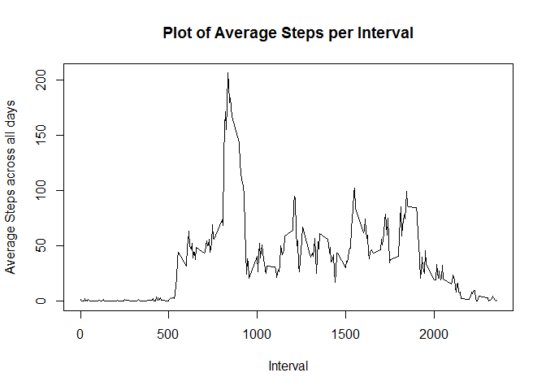
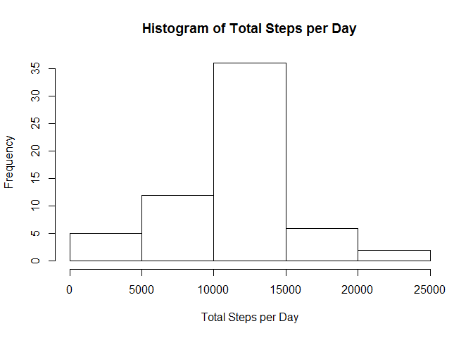
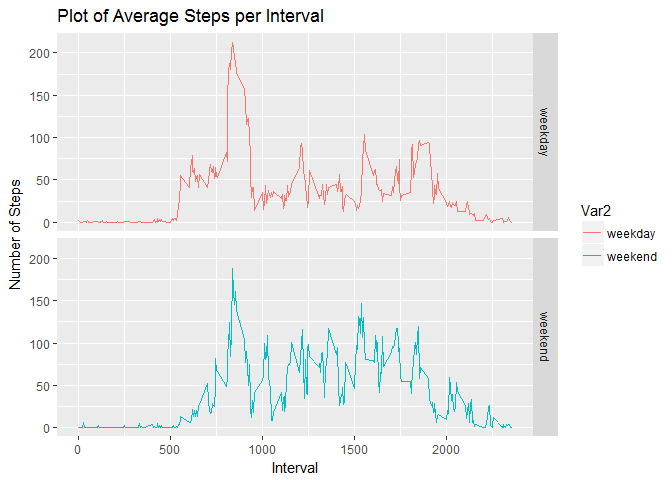

Assignment 1 for Reproducible Research Class
============================================

===================================================

Loading and preprocessing the data
----------------------------------

1.  load the data

<!-- -->

    df <- read.csv(file = "activity.csv", na.strings = "NA")

What is mean total number of steps taken per day?
-------------------------------------------------

1.  Calculate the total number of steps taken per day

<!-- -->

    total.steps <- with(df, tapply(steps, date, sum, na.rm=T))

1.  Make a histogram of the total number of steps taken each day

<!-- -->

    hist(total.steps, main = "Histogram of Total Steps per Day", xlab = "Total Steps per Day")

1.  Calculate and report the mean and median of the total number of
    steps taken per day

Mean:

    mean(total.steps)

    ## [1] 9354.23

Median:

    median(total.steps)

    ## [1] 10395

What is the average daily activity pattern?
-------------------------------------------

1.  calculate the average number of steps by 5-minute interval

<!-- -->

    average.steps <- with(df, tapply(steps, interval, mean, na.rm=T))

1.  Make a time series plot (i.e. type = "l") of the 5-minute
    interval (x-axis) and the average number of steps taken, averaged
    across all days (y-axis)

<!-- -->

    plot(names(average.steps), average.steps, type = "l", main = "Plot of Average Steps per Interval", xlab = "Interval", ylab = "Average Steps across all days")

1.  Which 5-minute interval, on average across all the days in the
    dataset, contains the maximum number of steps?

<!-- -->

    names(which.max(average.steps))

    ## [1] "835"

Imputing missing values
-----------------------

1.  Calculate and report the total number of missing values in the
    dataset

<!-- -->

    sum(is.na(df))

    ## [1] 2304

1.  filling in all of the missing values in the dataset with the mean
    for that interval, and create a new dataset

<!-- -->

    na <- is.na(df$steps)
    df.na <- df[na,]
    df.non.na <- df[!na,]
    x <- 0
    for (x in unique(df.na$interval)) {
            df.na[which(df.na$interval == x), 1] <- average.steps[which(names(average.steps) == x)]
            x <- x + 5
    }
    dfnew <- rbind(df.na, df.non.na)

1.  Make a histogram of the total number of steps taken each day

<!-- -->

    total.steps.new <- with(dfnew, tapply(steps, date, sum, na.rm=T))
    hist(total.steps.new, main = "Histogram of Total Steps per Day", xlab = "Total Steps per Day")

1.  Calculate and report the mean and median total number of steps taken
    per day.

Mean:

    mean(total.steps.new)

    ## [1] 10766.19

Median:

    median(total.steps.new)

    ## [1] 10766.19

Do these values differ from the estimates from the first part of the
assignment?

Yes.

What is the impact of imputing missing data on the estimates of the
total daily number of steps?

Imputing missing data increased the frequency of range 10000 ~ 15000
steps per day.

Are there differences in activity patterns between weekdays and weekends?
-------------------------------------------------------------------------

1.  Create a new factor variable in the dataset with two levels –
    “weekday” and “weekend” indicating whether a given date is a weekday
    or weekend day.

<!-- -->

    library(lubridate)

    ## 
    ## Attaching package: 'lubridate'

    ## The following object is masked from 'package:base':
    ## 
    ##     date

    library(dplyr)

    ## 
    ## Attaching package: 'dplyr'

    ## The following objects are masked from 'package:lubridate':
    ## 
    ##     intersect, setdiff, union

    ## The following objects are masked from 'package:stats':
    ## 
    ##     filter, lag

    ## The following objects are masked from 'package:base':
    ## 
    ##     intersect, setdiff, setequal, union

    dfnew$date <- as.Date(as.character(df$date), "%Y-%m-%d")
    dfnew.addfactor <- mutate(dfnew, weekday = factor(wday(date) %in% c(1,7), labels = c("weekday", "weekend")))

1.  Make a panel plot containing a time series plot (i.e. type = "l") of
    the 5-minute interval (x-axis) and the average number of steps
    taken, averaged across all weekday days or weekend days (y-axis).

<!-- -->

    average.steps.new <- with(dfnew.addfactor, tapply(steps, list(interval, weekday), mean, na.rm=T))
    type <- unique(dfnew.addfactor$weekday)
    library(reshape2)
    dfplot <- melt(average.steps.new, measure.vars = type)
    library(ggplot2)
    g <- ggplot(dfplot, aes(Var1, value))
    g + geom_line(aes(colour = Var2)) + facet_grid(Var2 ~ .) + labs(title = "Plot of Average Steps per Interval") + labs(x = "Interval") + labs(y = "Number of Steps")

